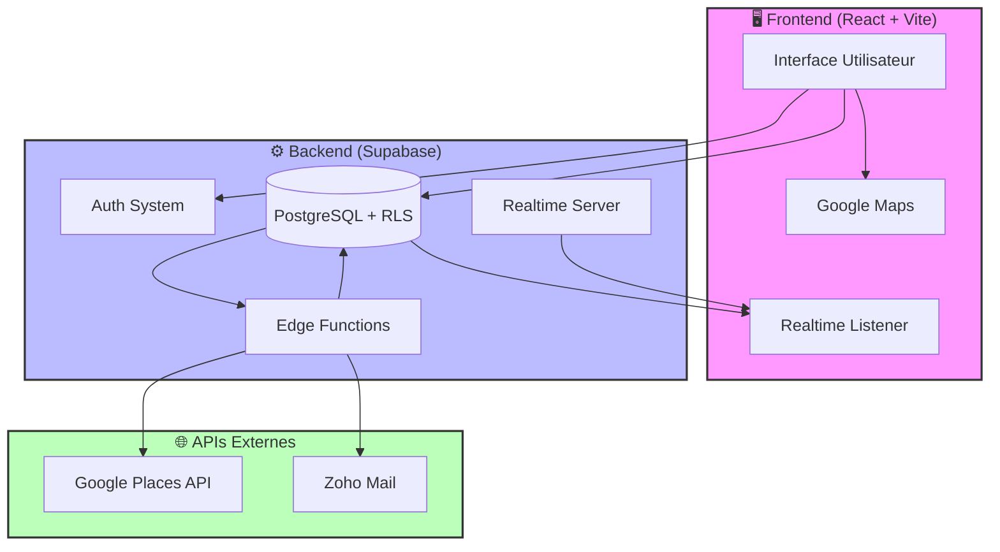
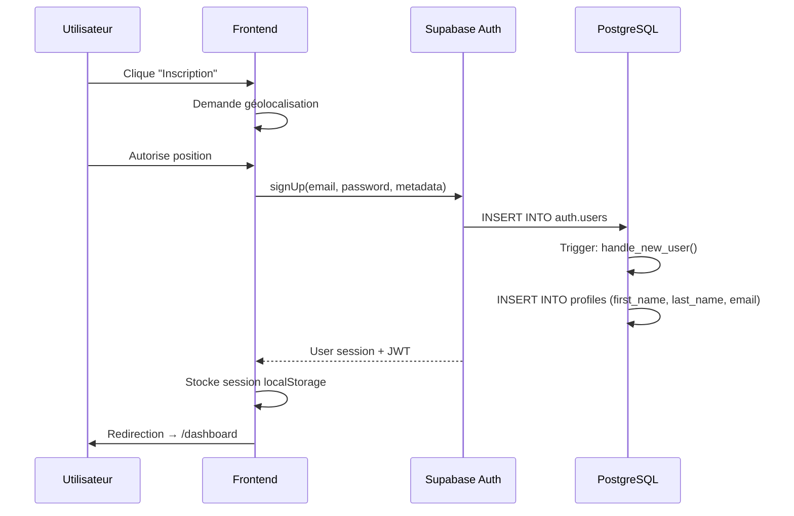
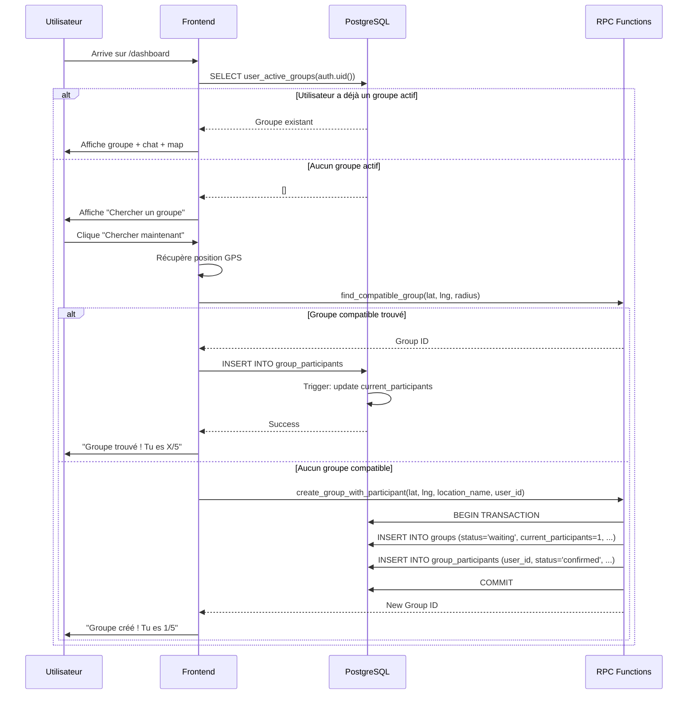
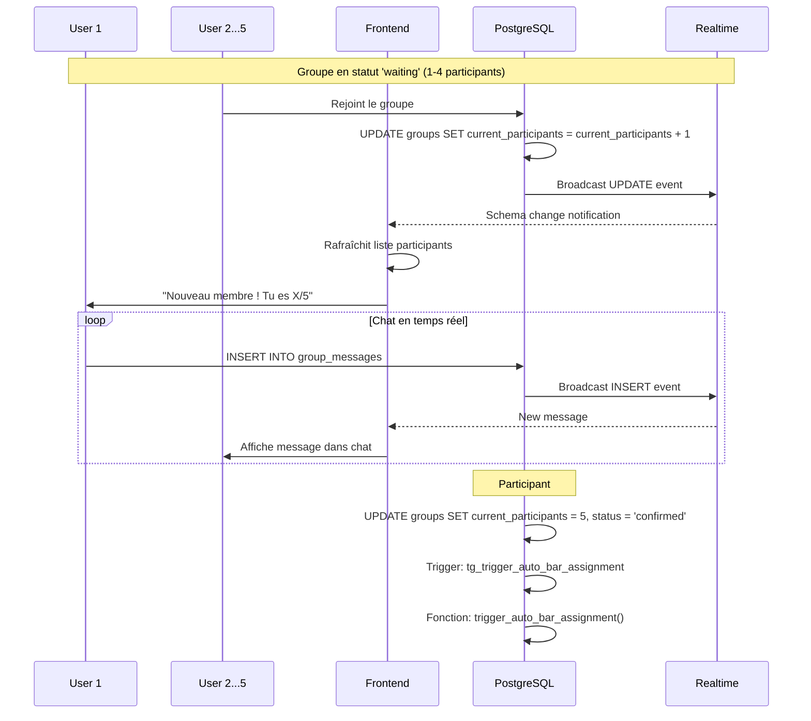
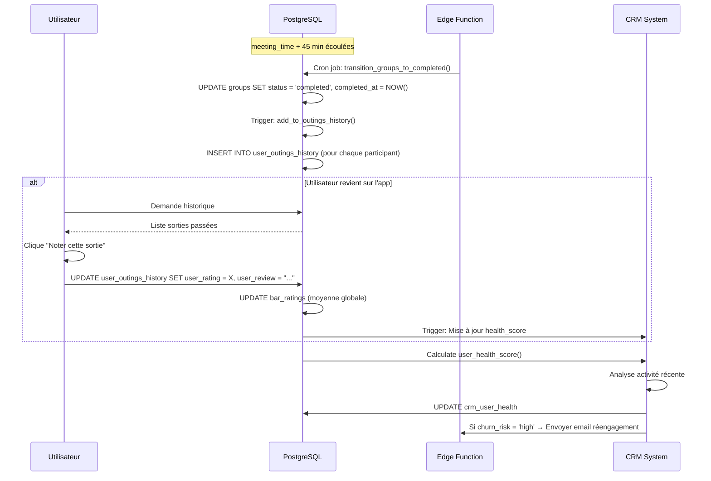
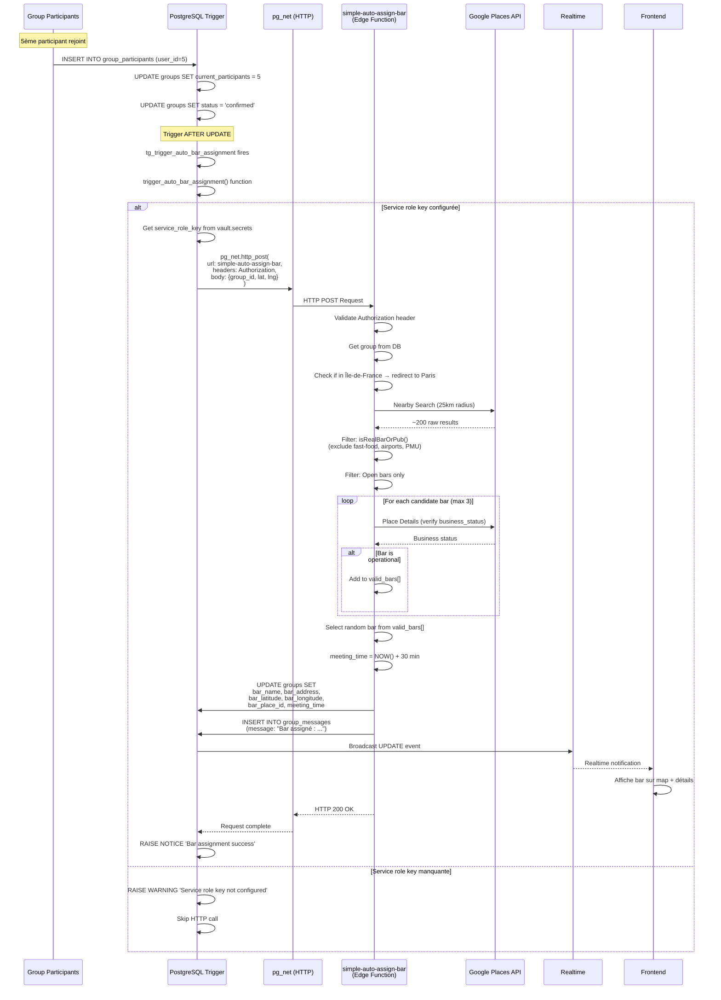

# ARCHITECTURE RANDOM

## 📖 Table des matières

1. [Qu'est-ce que Random ?](#quest-ce-que-random)
2. [Vision & Proposition de Valeur](#vision--proposition-de-valeur)
3. [Architecture Système](#architecture-système)
4. [Flux Utilisateur Complet](#flux-utilisateur-complet)
5. [Processus d'Assignment de Bar Automatique](#processus-dassignment-de-bar-automatique)
6. [Technologies Utilisées](#technologies-utilisées)
7. [Sécurité & Gouvernance](#sécurité--gouvernance)
8. [Observabilité & Analytics](#observabilité--analytics)
9. [Évolutivité & Performance](#évolutivité--performance)

---

## Qu'est-ce que Random ?

**Random** est une plateforme web qui révolutionne les sorties entre inconnus en éliminant toute friction :

> **1 clic. 5 inconnus. 1 bar.**

### Le Problème Résolu

Les applications de rencontre et de socialisation actuelles souffrent de :
- **Paradoxe du choix** : Trop d'options tue l'action
- **Charge mentale** : Choisir un lieu, organiser, coordonner
- **Flakes** : Les gens confirment mais ne viennent pas
- **Superficialité** : Profils aseptisés, conversations sans fin

### La Solution Random

Random résout ces problèmes par **l'élimination radicale du choix** :

1. **Tu cliques** → Random détecte ta position
2. **Tu attends** → Random forme un groupe de 5 personnes autour de toi
3. **Tu y vas** → Random choisit un bar ouvert et donne le RDV

**Zéro choix. Zéro organisation. 100% action.**

---

## Vision & Proposition de Valeur

### Mission

Réinjecter de l'authenticité et du spontané dans les relations humaines en forçant les gens à sortir de leur zone de confort digitale.

### Valeurs Fondamentales

1. **Radicalité** : Aucun compromis sur la simplicité. Pas de filtres, pas de swipe, pas de profils détaillés.
2. **Momentum** : Le temps est l'ennemi de l'action. Random force l'exécution immédiate.
3. **Égalité** : Pas de système de popularité ou de "match". Tout le monde a la même chance.
4. **Authenticité** : Les rencontres se font en vrai, dans un contexte social normal (un bar).

### Différenciation

| Critère | Random | Apps de Rencontre | Apps de Socialisation |
|---------|--------|-------------------|----------------------|
| **Temps avant action** | < 30 min | Jours/Semaines | Heures/Jours |
| **Charge cognitive** | Zéro | Élevée (choix) | Moyenne (coordination) |
| **Taux de concrétisation** | 100% (forced) | < 10% | ~30% |
| **Engagement requis** | 1 clic | Swipe infini | Planification |
| **Authenticité** | Maximale (IRL) | Faible (profils) | Moyenne (événements) |

---

## Architecture Système

### Vue d'Ensemble



### Stack Technique

#### Frontend
- **Framework** : React 18 + TypeScript
- **Build** : Vite (HMR ultra-rapide)
- **Routing** : React Router v6
- **State Management** : React Query (TanStack Query) + Context API
- **UI Components** : shadcn/ui + Tailwind CSS
- **Maps** : Google Maps JavaScript API
- **i18n** : react-i18next (français/anglais)

#### Backend
- **BaaS** : Supabase (PostgreSQL + Auth + Realtime + Edge Functions)
- **Database** : PostgreSQL 15+ avec Row Level Security (RLS)
- **Auth** : Supabase Auth (email/password, magic links)
- **Real-time** : Supabase Realtime (WebSocket)
- **Serverless** : Deno Edge Functions

#### APIs Externes
- **Google Places API** : Recherche de bars, vérification d'ouverture, détails
- **Zoho Mail API** : Envoi d'emails transactionnels

---

## Flux Utilisateur Complet

### 1️⃣ Phase d'Inscription / Connexion



**Points Clés** :
- **Géolocalisation immédiate** : Demandée dès l'inscription pour éviter les frictions ultérieures
- **Trigger automatique** : `handle_new_user()` crée le profil utilisateur dans `profiles` table
- **JWT** : Token d'authentification stocké côté client pour les appels API

### 2️⃣ Phase de Recherche de Groupe



**Algorithme de Matching** :
1. **Recherche dans un rayon** : Par défaut 25km (configurable)
2. **Critères de compatibilité** :
   - Groupe en statut `waiting`
   - Pas encore complet (`current_participants < 5`)
   - Créé il y a moins de 3 heures
   - Pas un groupe planifié (`is_scheduled = false`)
3. **Si aucun groupe** : Création automatique d'un nouveau groupe

### 3️⃣ Phase de Groupe Actif (Attente)



**Fonctionnalités du Chat** :
- **Temps réel** : Via Supabase Realtime (WebSocket)
- **Système de réactions** : Emojis sur les messages (stockés en JSONB)
- **Messages système** : Notifications automatiques (arrivée/départ de membres, bar assigné, etc.)
- **Validation** : Anti-spam, limite de 500 caractères, nettoyage XSS

### 4️⃣ Phase d'Assignment de Bar (Automatique)

**Voir section dédiée ci-dessous pour le détail complet.**

Résumé :
1. Le 5ème participant rejoint → `status = 'confirmed'`
2. Trigger SQL déclenché → Appel HTTP à `simple-auto-assign-bar`
3. Edge Function → Google Places API (recherche bars dans rayon 25km)
4. Filtrage intelligent (bars ouverts, pas de fast-food, etc.)
5. Sélection aléatoire → UPDATE `groups` avec bar_name, bar_address, meeting_time
6. Notification tous les participants (Realtime + Email)

### 5️⃣ Phase Post-Sortie (Completed)



**Système de Rating** :
- **Note de 1 à 5 étoiles** pour chaque bar visité
- **Review textuel** optionnel
- **Agrégation** : Calcul de la moyenne globale par bar (`bar_ratings` table)
- **Utilisation** : Les bars bien notés sont légèrement favorisés (algorithme futur)

**CRM & Health Score** :
- **Calcul automatique** du "health score" utilisateur (0-100)
- **Critères** : Fréquence de sortie, ancienneté, dernière activité, taux de complétion
- **Segmentation** : `low`, `medium`, `high`, `critical` churn risk
- **Automations** : Emails de réengagement si score < 30

---

## Processus d'Assignment de Bar Automatique

### Architecture Complète



### Détails Techniques

#### 1. Déclenchement (Trigger SQL)

**Fichier** : Migration `20251018153143_restore_trigger.sql` + `20251018_fix_trigger_http_call.sql`

**Conditions** :
```sql
WHEN (OLD.status = 'waiting' AND NEW.status = 'confirmed' AND NEW.bar_name IS NULL)
```

**Sécurités** :
- **Anti-doublon** : Vérifie qu'aucun message `AUTO_BAR_ASSIGNMENT_TRIGGER` n'a été créé dans les 2 dernières minutes
- **Validation** : Nécessite `service_role_key` configurée (via Vault ou app.settings)

**Appel HTTP** :
```sql
SELECT extensions.pg_net.http_post(
    url := 'https://xhrievvdnajvylyrowwu.supabase.co/functions/v1/simple-auto-assign-bar',
    headers := jsonb_build_object(
        'Content-Type', 'application/json',
        'Authorization', 'Bearer ' || service_role_key
    ),
    body := jsonb_build_object(
        'group_id', NEW.id,
        'latitude', NEW.latitude,
        'longitude', NEW.longitude
    )
);
```

#### 2. Edge Function (simple-auto-assign-bar)

**Fichier** : `supabase/functions/simple-auto-assign-bar/index.ts`

**Algorithme de Filtrage** :

```typescript
function isRealBarOrPub(place: any): boolean {
  const types = place.types || [];
  const name = (place.name || '').toLowerCase();
  
  // 1. Priorité aux bars purs
  if (types.includes('bar') || types.includes('night_club')) {
    // Exclure les fast-foods déguisés
    if (name.includes('mcdonald') || name.includes('kfc') || 
        name.includes('burger king') || name.includes('quick')) {
      return false;
    }
    return true;
  }
  
  // 2. Bar-restaurants acceptés
  if (types.includes('bar') && types.includes('restaurant')) {
    return true;
  }
  
  // 3. Exclusions strictes
  const exclusions = [
    'airport', 'bus_station', 'train_station', // Transports
    'bar_tabac', 'pmu', 'fdj', // PMU/Tabac
    'cafe', 'bakery', 'meal_takeaway', // Restauration rapide
    'grocery_or_supermarket', 'convenience_store' // Commerces
  ];
  
  if (exclusions.some(ex => types.includes(ex) || name.includes(ex))) {
    return false;
  }
  
  return false; // Par défaut, refuser
}
```

**Système de Priorité** :
```typescript
function getBarPriority(place: any): number {
  const types = place.types || [];
  
  if (types.includes('bar') && !types.includes('restaurant')) {
    return 10; // Bar pur = priorité max
  }
  if (types.includes('bar') && types.includes('restaurant')) {
    return 7; // Bar-restaurant = OK
  }
  if (types.includes('night_club')) {
    return 8; // Boîte de nuit = priorité élevée
  }
  if (types.includes('brewery')) {
    return 9; // Brasserie = priorité élevée
  }
  if (types.includes('wine_bar') || types.includes('cocktail_bar')) {
    return 6; // Bars spécialisés = correct
  }
  if (types.includes('hotel') && types.includes('bar')) {
    return 3; // Bar d'hôtel = faible priorité
  }
  return 1; // Autres = très faible
}
```

**Vérification du Statut d'Ouverture** :
```typescript
async function verifyBarBusinessStatus(placeId: string): Promise<boolean> {
  const response = await fetch(
    `https://maps.googleapis.com/maps/api/place/details/json?place_id=${placeId}&fields=business_status&key=${apiKey}`
  );
  const data = await response.json();
  
  return data.result?.business_status === 'OPERATIONAL';
}
```

**Sélection Finale** :
1. **Filtrer** : Garde uniquement les `isRealBarOrPub() === true`
2. **Vérifier** : Appelle `verifyBarBusinessStatus()` pour les 3 meilleurs
3. **Randomiser** : Sélection aléatoire parmi les bars valides
4. **Meeting Time** : `NOW() + 30 minutes`

#### 3. Gestion des Zones Géographiques

**Détection Île-de-France** :
```typescript
// Si l'utilisateur est en Île-de-France, rediriger la recherche vers Paris
if (isInIleDeFrance(latitude, longitude)) {
  latitude = 48.8566; // Paris centre
  longitude = 2.3522;
  searchRadius = 25000; // 25km
}
```

**Raisons** :
- Concentration maximale de bars à Paris
- Évite les recherches dans les banlieues peu fournies
- Améliore les chances de trouver un bar de qualité

#### 4. Notifications & Realtime

**Après assignment** :
1. **UPDATE** `groups` table → Realtime broadcast
2. **INSERT** message système dans chat : `"🎉 Bar assigné : {bar_name} à {bar_address}"`
3. **Frontend** : Détection du changement via `useUnifiedGroups()` hook
4. **Affichage** : Mise à jour automatique de la carte + détails du bar

**Email** (futur) :
- Notification par email 15 minutes avant `meeting_time`
- Template Zoho avec lien Google Maps du bar

---

## Technologies Utilisées

### Frontend

| Technologie | Version | Rôle |
|-------------|---------|------|
| **React** | 18.3.1 | Framework UI |
| **TypeScript** | 5.x | Typage statique |
| **Vite** | 5.x | Build tool ultra-rapide |
| **React Query** | 5.56.2 | State management asynchrone |
| **React Router** | 6.26.2 | Routing SPA |
| **Tailwind CSS** | 3.x | Styling utility-first |
| **shadcn/ui** | Latest | Composants UI (Radix UI) |
| **Google Maps JS API** | Latest | Affichage carte interactive |
| **i18next** | 25.3.6 | Internationalisation (FR/EN) |
| **Lucide React** | 0.462.0 | Icônes |
| **date-fns** | 3.6.0 | Manipulation dates |

### Backend

| Technologie | Version | Rôle |
|-------------|---------|------|
| **Supabase** | Latest | Backend-as-a-Service complet |
| **PostgreSQL** | 15+ | Base de données relationnelle |
| **Row Level Security** | Native PG | Sécurité au niveau des lignes |
| **Realtime** | Supabase | WebSocket pour mises à jour live |
| **Edge Functions** | Deno | Serverless pour logique métier |
| **pg_net** | Supabase | Extension pour appels HTTP depuis SQL |
| **Supabase Auth** | Latest | Authentification (email/password, magic links) |

### APIs & Services

| Service | Usage | Coût Estimé |
|---------|-------|-------------|
| **Google Places API** | Recherche bars + Détails + Vérification ouverture | ~$0.017/req (Nearby Search) + $0.017/req (Details) |
| **Zoho Mail API** | Envoi emails transactionnels | Gratuit jusqu'à 5000/jour |
| **Google Analytics** | Tracking événements | Gratuit |
| **Supabase** | Base de données + Auth + Realtime | Free tier : 500MB DB, 2GB bandwidth |

---

## Sécurité & Gouvernance

### Row Level Security (RLS)

**Principe** : Chaque table a des politiques RLS qui définissent qui peut lire/écrire quoi.

#### Exemples de Politiques

**Table `groups`** :
```sql
-- Les utilisateurs authentifiés peuvent voir les groupes actifs
CREATE POLICY "authenticated_users_can_view_active_groups"
ON public.groups
FOR SELECT
TO authenticated
USING (
  auth.uid() IS NOT NULL 
  AND status IN ('waiting', 'confirmed')
);

-- Les membres d'un groupe peuvent le modifier
CREATE POLICY "Group members can update their group"
ON public.groups
FOR UPDATE
TO authenticated
USING (
  EXISTS (
    SELECT 1 FROM group_participants
    WHERE group_id = groups.id 
    AND user_id = auth.uid() 
    AND status = 'confirmed'
  )
);
```

**Table `group_messages`** :
```sql
-- Les membres peuvent envoyer des messages
CREATE POLICY "authenticated_users_can_send_messages_v2"
ON public.group_messages
FOR INSERT
TO authenticated
WITH CHECK (
  auth.uid() = user_id 
  AND is_user_in_group(group_id, auth.uid())
);

-- Les membres peuvent lire les messages
CREATE POLICY "authenticated_users_can_read_group_messages_v2"
ON public.group_messages
FOR SELECT
TO authenticated
USING (
  auth.uid() IS NOT NULL 
  AND is_user_in_group(group_id, auth.uid())
);
```

### Validation des Données

**Messages** :
```sql
CREATE FUNCTION validate_and_clean_message(input_message text)
RETURNS text AS $$
BEGIN
  input_message := trim(input_message);
  
  IF length(input_message) = 0 THEN
    RAISE EXCEPTION 'Message cannot be empty';
  END IF;
  
  IF length(input_message) > 500 THEN
    RAISE EXCEPTION 'Message too long (max 500 characters)';
  END IF;
  
  -- Échapper les caractères dangereux
  input_message := replace(input_message, '<script', '&lt;script');
  input_message := replace(input_message, 'javascript:', 'javascript_');
  
  RETURN input_message;
END;
$$ LANGUAGE plpgsql;
```

**Coordonnées GPS** :
```sql
CREATE FUNCTION validate_coordinates_strict(lat double precision, lng double precision)
RETURNS boolean AS $$
BEGIN
  -- Sanitize d'abord
  SELECT * INTO sanitized_result FROM sanitize_coordinates_pg(lat, lng);
  lat := sanitized_result.sanitized_lat;
  lng := sanitized_result.sanitized_lng;
  
  -- Vérifications
  IF lat IS NULL OR lng IS NULL THEN RETURN false; END IF;
  IF lat < -90.0 OR lat > 90.0 THEN RETURN false; END IF;
  IF lng < -180.0 OR lng > 180.0 THEN RETURN false; END IF;
  
  RETURN true;
END;
$$ LANGUAGE plpgsql;
```

### Authentification

- **JWT** : Tous les appels API nécessitent un token JWT valide
- **Service Role** : Les Edge Functions utilisent le `service_role_key` pour les opérations admin
- **Magic Links** : Alternative à l'email/password (future implémentation)
- **Rate Limiting** : Protection contre les abus (future implémentation)

### Audit & Logs

**Tables d'audit** :
- `admin_audit_log` : Toutes les actions admin (création/modification/suppression)
- `security_audit_log` : Événements de sécurité (tentatives de connexion, changements de profil)
- `api_requests_log` : Toutes les requêtes aux APIs externes (Google Places, etc.)

**Exemple d'audit** :
```sql
INSERT INTO admin_audit_log (
  admin_user_id,
  action_type,
  table_name,
  record_id,
  metadata
) VALUES (
  auth.uid(),
  'DELETE_GROUP',
  'groups',
  target_group_id,
  json_build_object('reason', 'spam')
);
```

---

## Observabilité & Analytics

### Métriques Clés (KPIs)

#### Métriques d'Acquisition
- **Signups/jour** : Nombre de nouveaux comptes
- **Source** : Organic, Referral, Social, Direct
- **Conversion** : % visiteurs → inscrits

#### Métriques d'Engagement
- **DAU/MAU** : Daily/Monthly Active Users
- **Groups created/day** : Nombre de groupes créés par jour
- **Groups completed/day** : Nombre de sorties réalisées par jour
- **Completion rate** : % groupes confirmés qui aboutissent à une sortie
- **Average time to full** : Temps moyen pour former un groupe de 5
- **Chat activity** : Nombre de messages envoyés par groupe

#### Métriques de Rétention
- **D1/D7/D30 retention** : % utilisateurs qui reviennent après 1/7/30 jours
- **Churn rate** : % utilisateurs inactifs > 30 jours
- **Outings per user** : Nombre moyen de sorties par utilisateur

#### Métriques Opérationnelles
- **Bar assignment success rate** : % de groupes qui reçoivent un bar
- **Bar assignment latency** : Temps moyen entre "confirmed" et bar assigné
- **Google Places API costs** : Coût par jour/mois
- **Database size** : Croissance de la base de données

### Outils d'Analytics

#### Google Tag Manager (GTM)
**Fichier** : `AnalyticsProvider.tsx`

**Événements trackés** :
```typescript
// Exemple d'événement
window.dataLayer?.push({
  event: 'scheduled_group_activated',
  group_id: groupId,
  participants_count: participantsCount,
  timestamp: Date.now()
});
```

**Liste complète des événements** :
- `page_view` : Visite de page
- `user_signup` : Inscription utilisateur
- `group_created` : Création d'un groupe
- `group_joined` : Rejoindre un groupe
- `group_confirmed` : Groupe complet (5/5)
- `bar_assigned` : Bar assigné automatiquement
- `group_completed` : Sortie terminée
- `bar_rated` : Notation d'un bar
- `scheduled_group_activated` : Activation d'un groupe planifié

#### Supabase Dashboard
- **Database Stats** : Nombre de lignes, taille, index
- **Realtime Connections** : Nombre de connexions WebSocket actives
- **Edge Functions Logs** : Logs des exécutions serverless
- **Auth Events** : Connexions, déconnexions, erreurs

#### Logs PostgreSQL
**Accès** : Via Supabase Dashboard → Database → Logs

**Exemple de log** :
```sql
RAISE NOTICE 'Bar assignment HTTP request sent (request_id: %) for group %', request_id, group_id;
```

### CRM & Health Score

**Calcul automatique** : Via fonction `calculate_user_health_score(user_id)`

**Critères** :
- Ancienneté du compte (`days_since_signup`)
- Dernière activité (`days_since_last_activity`)
- Dernière connexion (`days_since_last_login`)
- Nombre de sorties (`total_outings`)
- Fréquence (`avg_days_between_outings`)

**Segmentation** :
- **Churn risk low** (score ≥ 70) : Utilisateurs très actifs
- **Churn risk medium** (50-69) : Utilisateurs actifs modérés
- **Churn risk high** (30-49) : Utilisateurs à risque
- **Churn risk critical** (< 30) : Utilisateurs inactifs

**Automations** :
- Si `churn_risk = 'critical'` → Email "On t'a manqué ?" (via `lifecycle-automations` Edge Function)
- Si `churn_risk = 'high'` → Notification in-app "Reviens faire une sortie !"

---

## Évolutivité & Performance

### Optimisations Actuelles

#### Base de Données
- **Indexes** : Sur toutes les colonnes fréquemment requêtées (group_id, user_id, status, created_at)
- **Triggers optimisés** : BEFORE/AFTER clairement séparés pour éviter les conflits
- **RLS minimale** : Une seule politique SELECT sur `groups` pour réduire la charge

#### Frontend
- **Lazy Loading** : Sections below-the-fold chargées à la demande
- **React Query** : Cache intelligent, pas de refetch au focus
- **Optimistic UI** : Mise à jour immédiate de l'UI avant confirmation serveur
- **Image Optimization** : Lazy loading des images, formats modernes (WebP)
- **Code Splitting** : Routes séparées en chunks

#### Backend
- **Edge Functions** : Exécution au plus près de l'utilisateur (CDN)
- **Connection Pooling** : Réutilisation des connexions PostgreSQL
- **Realtime Selective** : Subscription uniquement aux groupes actifs de l'utilisateur

### Limites Actuelles

#### Scalabilité Géographique
- **Couverture** : Principalement Paris/Île-de-France
- **Google Places API** : Limité à 60 000 requêtes/mois sur le tier gratuit
- **Solution** : Expansion progressive ville par ville avec caching des bars populaires

#### Scalabilité Utilisateurs
- **Supabase Free Tier** : 500 MB DB, 2 GB bandwidth/mois
- **Limite théorique** : ~10 000 utilisateurs actifs/mois
- **Solution** : Migration vers Supabase Pro ($25/mois) → 8 GB DB, 50 GB bandwidth

#### Performance Realtime
- **WebSocket** : Max ~500 connexions simultanées sur Free Tier
- **Chat** : Peut ralentir si > 100 groupes actifs simultanés
- **Solution** : Throttling côté client, pagination des messages

### Stratégie de Scalabilité Future

#### Phase 1 : Optimisation (0-10K utilisateurs)
- Caching des bars populaires (Redis)
- Rate limiting côté serveur (Supabase RPC)
- Monitoring avancé (Sentry, Datadog)

#### Phase 2 : Expansion Géographique (10K-100K utilisateurs)
- Database sharding par région
- CDN pour assets statiques (Cloudflare)
- Multi-région Supabase (Europe, US)

#### Phase 3 : Scale Massive (100K+ utilisateurs)
- Microservices pour logique critique (bar assignment, matching)
- Message Queue (RabbitMQ, Kafka) pour événements asynchrones
- Kubernetes pour orchestration

---

## Glossaire

- **Random** : Nom de l'application
- **Groupe** : Ensemble de 5 utilisateurs réunis pour une sortie
- **Bar Assignment** : Processus automatique de sélection d'un bar
- **Meeting Time** : Heure du rendez-vous au bar (généralement NOW + 30 min)
- **Churn Risk** : Probabilité qu'un utilisateur devienne inactif
- **Health Score** : Note de 0 à 100 reflétant l'activité d'un utilisateur
- **RLS** : Row Level Security (sécurité au niveau des lignes PostgreSQL)
- **Edge Function** : Fonction serverless exécutée sur Deno
- **Realtime** : Système de WebSocket pour mises à jour en temps réel

---

## Liens Utiles

- **Production** : https://lovable.dev/projects/b6b6f598-5ec8-4ec8-4b79-9c09-9a0afc7454e2
- **Supabase Dashboard** : https://supabase.com/dashboard/project/xhrievvdnajvylyrowwu
- **Google Places API Docs** : https://developers.google.com/maps/documentation/places/web-service
- **Supabase RLS Guide** : https://supabase.com/docs/guides/database/postgres/row-level-security
- **Supabase Realtime** : https://supabase.com/docs/guides/realtime

---

**Dernière mise à jour** : 18 octobre 2025  
**Version** : 1.0.0  
**Auteur** : Équipe Random